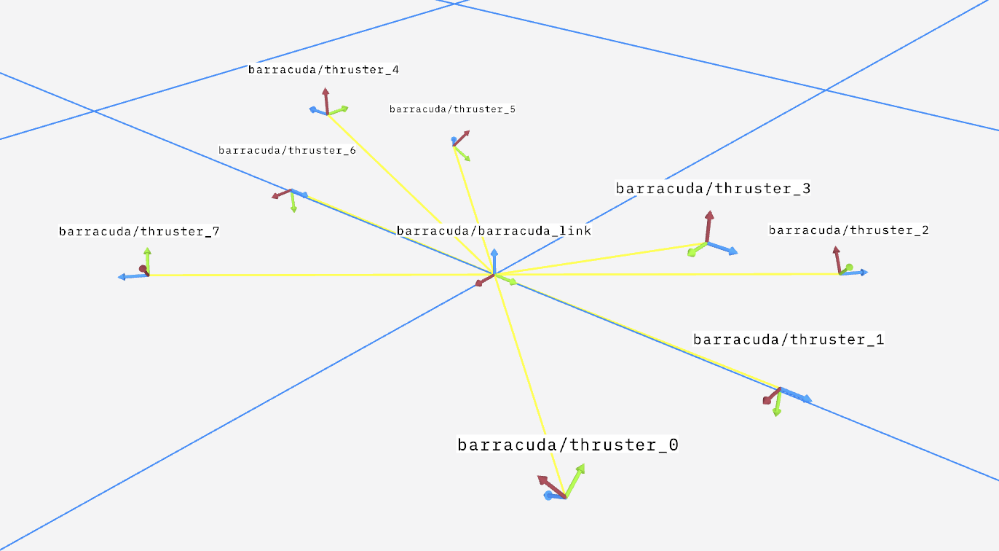

# Barracuda Control
```
Thruster Board Mapping:
Which Side of the Sub: -Pitch Axis    +Pitch Axis
I2C Address:           __0x2d___    __0x2e___
PWM Pins:              |5|4|0|1|    |5|4|0|1|
Thruster Index:        |0|1|2|3|    |4|5|6|7|
Thruster Position:     |F|S|B|T|    |T|B|S|F|	
```


