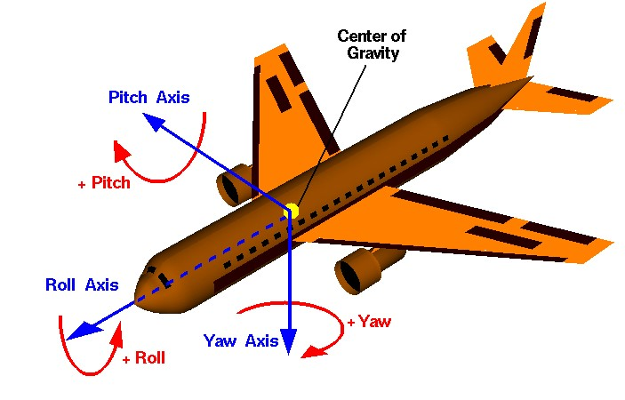

# barracuda_description

```
Thruster Board Mapping:
Which Side of the Sub: -Pitch Axis    +Pitch Axis
I2C Address:           __0x2d___    __0x2e___
PWM Pins:              |5|4|0|1|    |5|4|0|1|
Thruster Index:        |0|1|2|3|    |4|5|6|7|
Thruster Position:     |F|S|B|T|    |T|B|S|F|	
```



> Note the underscore in the repository name - This is a ROS package, designed for ROS Noetic

Contains the robot descriptor files for the *barracuda*. 

## Usage Notes
To use this repository, clone this repo in a catkin workspace's source directory, and use `catkin_make`, or clone as a submodule in a repo that contains a catkin workspace.

## Dependencies

ROS Packages:
- [robot_state_publisher](https://wiki.ros.org/robot_state_publisher)
- [xacro](https://wiki.ros.org/xacro)
